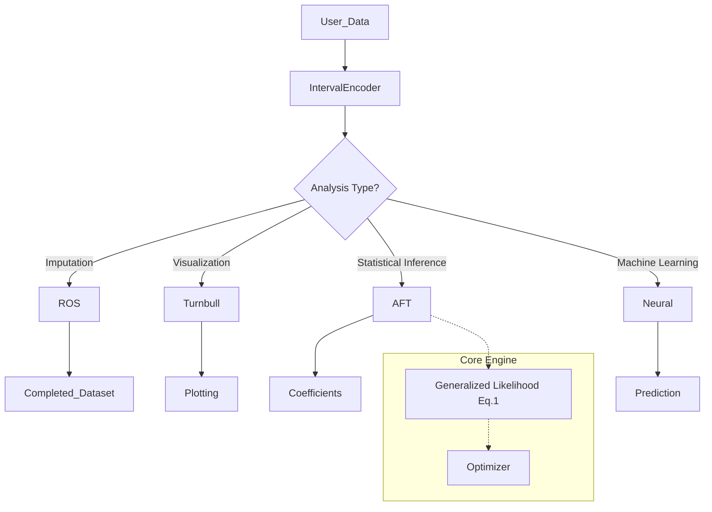

# Comprehensive Analysis of Statistical Methodologies and Computational Frameworks for Arbitrarily Censored Data: State of the Art, Software Landscape, and Engineering Roadmap

## 1. Introduction: The Complexity of Partial Observability

In the rigorous analysis of time-to-event data, the phenomenon of censoring represents a fundamental challenge to statistical inference. Unlike standard regression problems where the response variable is fully observed, survival analysis and reliability engineering operate in a domain where the variable of interest—be it the survival time of a patient, the failure time of a mechanical component, or the concentration of a pollutant—is often latent. The analyst observes not the variable itself, but a window of time or a range of values during which the event may or may not have occurred. When a dataset exhibits a heterogeneous mixture of censoring types—incorporating left censoring, right censoring, and interval censoring simultaneously—it is referred to as arbitrarily censored or mixed-case censored data. This report addresses the theoretical underpinnings, state-of-the-art methodologies, and software engineering strategies required to analyze such data with rigor.

The necessity for advanced methods arises because standard techniques, most notably the Kaplan-Meier estimator and the standard Cox Proportional Hazards model, are mathematically predicated on the assumption of right censoring. Right censoring, where subjects are followed until a study end time or withdrawal, preserves the order of events and allows for the derivation of partial likelihoods based on risk sets. However, the introduction of left censoring (where the event occurs prior to observation or values are below a detection limit) or interval censoring (where the event occurs between two observation points) destroys this ordering. The exact time or value is unknown, rendering the classical risk set undefined. Consequently, applying right-censoring methods to arbitrarily censored data—or worse, imputing censored values with simple midpoints or detection limits—introduces structural biases that compromise the validity of any resulting inference.

The scope of this report is exhaustive. It begins by formalizing the taxonomy of censoring. It then proceeds to a critical evaluation of statistical best practices, contrasting the theoretical ideal (the generalized likelihood) with heuristic approximations. A substantial portion of the analysis is dedicated to a comparative review of the current software ecosystem, juxtaposing the mature tools available in R (including specialized environmental statistics packages like NADA) against the rapidly evolving Python landscape. Finally, the report outlines a "Regression on Order Statistics" framework for imputation and synthesizes these insights into an architectural blueprint for a new Python package.

## 2. Taxonomy and Theoretical Foundations of Censored Data

To construct a robust analytical framework, one must first rigorously define the data generating mechanisms. Censoring is not merely missing data; it is a specific form of information occluded by the observation process.

### 2.1 The Spectrum of Information Loss

The random variable of interest is the true event time or value, denoted as $T^*$. In an ideal setting, $T^*$ is observed precisely. In a censored setting, we observe a pair of random variables $(L, R)$ such that $T^* \in (L, R]$. The nature of the interval $(L, R]$ defines the censoring type.

#### 2.1.1 Right Censoring (Case I)

Right censoring is the most prevalent form of censoring in clinical trials and reliability testing.

*   **Observation:** The analyst observes $T = \min(T^*, C_r)$ and an event indicator $\delta = I(T^* \le C_r)$. If $\delta=0$, the observation is censored.
*   **Interval Representation:** In the context of arbitrary censoring, a right-censored observation is represented as the interval $(C_r, \infty)$.
*   **Information Content:** The data provides the information that the survival time exceeds $C_r$. Crucially, for standard right censoring mechanisms, the censoring time $C_r$ is assumed to be independent of the future event time $T^*$ (non-informative censoring).1

#### 2.1.2 Left Censoring

Left censoring occurs when the event of interest has already happened before the subject serves their first observation or the value is below a measurement threshold.

*   **Observation:** The analyst observes a time or value $C_l$ and knows only that $T^* \le C_l$.
*   **Interval Representation:** This is represented as the interval $(0, C_l]$ (or $(-\infty, C_l]$ for non-time data).
*   **Domain Prevalence:** This type of censoring is ubiquitous in environmental sciences (e.g., chemical concentrations below a Limit of Detection, LOD) and in retrospective medical studies (e.g., a patient tests positive for a disease at enrollment, implying onset occurred sometime in the past).3

#### 2.1.3 Interval Censoring (Case II)

Interval censoring generalizes both left and right censoring. It arises when a subject is not monitored continuously but rather at discrete time points $t_1, t_2, \dots, t_k$.

*   **Observation:** The analyst observes the interval $(t_j, t_{j+1}]$.
*   **Information Content:** The event occurred within the window, but the distribution of probability mass within that window is unknown.
*   **Generalization:** Mathematically, exact observations are degenerate intervals where $L=R$; left censoring is an interval where $L=0$; and right censoring is an interval where $R=\infty$. A robust software package must treat all data as interval-censored to provide a unified API.5

#### 2.1.4 Double Censoring

A higher-order complexity arises in double censoring, where the duration of interest is the difference between two events, $T = T_{end} - T_{start}$, and both the start time and the end time are interval-censored.

*   **Example:** In an infectious disease study, the incubation period is the time from infection to symptom onset. If the time of infection is known only to be in $(L_{inf}, R_{inf}]$ and the time of symptom onset is in $(L_{sym}, R_{sym}]$, the duration $T$ is doubly censored.7

### 2.2 Mathematical Formulation of the General Likelihood

The foundational pillar of statistical best practice for arbitrary censoring is the Generalized Likelihood Function.

Let $\theta$ represent the vector of parameters for the survival distribution (e.g., shape and scale for a Weibull model). For a sample of $N$ independent subjects, the likelihood function $L(\theta)$ is the product of the individual contributions. Defining $f(t|\theta)$ as the probability density function (PDF) and $S(t|\theta) = P(T > t)$ as the survival function, the contribution of a subject $i$ with observed interval $(L_i, R_i]$ is:

*   **Exact Observation** ($L_i = R_i$): $\mathcal{L}_i = f(L_i | \theta)$
*   **Right Censoring** ($R_i = \infty$): $\mathcal{L}_i = S(L_i | \theta)$
*   **Left Censoring** ($L_i = 0$): $\mathcal{L}_i = 1 - S(R_i | \theta)$
*   **Interval Censoring** ($0 < L_i < R_i < \infty$): $\mathcal{L}_i = S(L_i | \theta) - S(R_i | \theta)$

The aggregate log-likelihood function (Equation 1) is:

$$\ell(\theta) = \sum_{i \in \text{Exact}} \log f(T_i|\theta) + \sum_{i \in \text{Right}} \log S(L_i|\theta) + \sum_{i \in \text{Left}} \log (1 - S(R_i|\theta)) + \sum_{i \in \text{Interval}} \log (S(L_i|\theta) - S(R_i|\theta))$$

## 3. Statistical Best Practices: Beyond Substitution

### 3.1 The Fallacy of Substitution Methods

A common practice, particularly in environmental science (handling non-detects) and manufacturing, is substitution.

*   **Method:** Replace left-censored values ($< LOD$) with $0$, $LOD$, or $LOD/2$. Replace interval-censored values $(L, R)$ with the midpoint $(L+R)/2$.
*   **Statistical Verdict:** These methods are biased and inconsistent. Substituting $LOD/2$ artificially reduces the variance of the dataset, leading to false positives in hypothesis testing. Midpoint imputation assumes a uniform hazard within the interval, which is often physically incorrect.3

### 3.2 Non-Parametric Best Practice: The Turnbull Estimator

For right-censored data, the Kaplan-Meier estimator is the standard. For mixed censoring, the Turnbull Estimator (1976), also known as the Non-Parametric Maximum Likelihood Estimator (NPMLE), is the gold standard.3

*   **Algorithm:** The Turnbull algorithm assigns probability mass to a set of discrete intervals called "equivalence classes," derived from the intersections of all observation intervals in the dataset. It typically utilizes an EM algorithm (Self-Consistency) to iteratively update these masses to maximize the likelihood defined in Equation 1.

### 3.3 Parametric Best Practice: Accelerated Failure Time (AFT) Models

When the goal is inference, statistical best practice shifts toward parametric Accelerated Failure Time (AFT) models fitted via the Generalized Likelihood (Equation 1).

*   **Model Form:** $\log(T) = \beta_0 + \beta_1 X_1 + \dots + \sigma \epsilon$.
*   **Why Best Practice?** AFT models act directly on the time scale (time ratios), are robust to heavy censoring, and their likelihoods are well-defined for any combination of left, right, and interval censoring.3

## 4. Software Landscape: R vs. Python

The software landscape is bifurcated: R offers mature, specialized statistical packages for both survival and environmental analysis, while Python offers flexibility and integration with deep learning but requires more manual assembly for censored data.

### 4.1 The R Ecosystem: The Current Gold Standard

R benefits from decades of development in biostatistics and environmental sciences.

#### 4.1.1 icenReg (Interval Censored Regression)

This package represents the state of the art for general survival analysis.

*   **Algorithm:** Implements the ICM algorithm (Iterative Convex Minorant), which is vastly more efficient than EM for interval-censored data.
*   **Features:** Supports Turnbull estimator (NPMLE), Proportional Hazards, and Proportional Odds models with left, right, and interval censoring.12

#### 4.1.2 NADA and NADA2 (Nondetects And Data Analysis)

These packages are the industry standard for environmental statistics, where left censoring is the primary concern (e.g., chemical concentrations below detection limits).

*   **Focus:** They specifically address the analysis of "nondetects" without simple substitution.
*   **Key Features:**
    *   **ROS (Regression on Order Statistics):** Implements robust ROS for imputing left-censored data to estimate summary statistics (mean, variance) without assuming a full parametric distribution for the entire dataset.
    *   **Censored Boxplots:** Draws boxplots that correctly account for the probability mass below the detection limit using ROS or MLE.
    *   **Hypothesis Testing:** Includes versions of the Wilcoxon Rank Sum test (Peto-Peto) adapted for left-censored data (cen1way, cen2means).
    *   **Permutation Tests:** NADA2 adds permutation tests (e.g., anosimPlot) which are distribution-free and highly robust for small, heavily censored environmental datasets.

### 4.2 The Python Ecosystem: The Challenger

#### 4.2.1 lifelines

*   **Role:** The most popular "pure Python" survival library.
*   **Censoring Support:** Excellent for right censoring. Support for left/interval censoring is available in parametric models (WeibullFitter) but absent in the Cox model implementation.14

#### 4.2.2 SurPyval

*   **Role:** A specialized library for reliability engineering.
*   **Censoring Support:** The most comprehensive Python package for this specific problem. It uses Autograd to compute gradients of the Generalized Likelihood (Equation 1), supporting arbitrary combinations of left, right, and interval censoring for parametric models. It also includes a native Turnbull estimator.16

#### 4.2.3 scikit-survival

*   **Role:** Machine Learning (SVM, Random Forests).
*   **Limitation:** Strictly limited to right censoring. Not suitable for left/interval censored data without modification.17

## 5. Imputation Strategies: Regression on Order Statistics (ROS)

While likelihood-based methods (Section 2.2) are statistically superior because they use all information without "making up" data, analysts often require imputed values to feed into standard algorithms (e.g., PCA, standard regression, visualization). The method of choice for this is Regression on Order Statistics (ROS).

### 5.1 Left Censored Data ("Nondetects")

For data censored at the lower end (e.g., $< LOD$), Robust ROS is the accepted best practice in environmental sciences, favored over Maximum Likelihood (MLE) for small sample sizes because it is semi-parametric. It assumes the data follows a distribution (usually Lognormal) only to impute the censored values, while keeping observed values as they are..

**The ROS Algorithm:**

1.  **Plotting Positions:** Compute the plotting positions (percentiles) for all $N$ data points. Unlike standard data, censored data requires establishing positions based on the proportion of censored vs. uncensored values. The positions for censored values are typically spread uniformly between 0 and the censoring limit's percentile.
2.  **Regression:** Fit a linear regression line to the observed (uncensored) data on a probability plot.
    *   $X$: Theoretical quantiles of the assumed distribution (e.g., standard normal $Z$-scores).
    *   $Y$: Observed values (usually log-transformed).
    *   **Model:** $\log(\text{Observation}) = \text{Intercept} + \text{Slope} \times \text{Quantile}$.
3.  **Imputation:** For each censored observation, use its assigned plotting position to find the corresponding theoretical quantile ($Z$), and plug this into the regression equation to predict the value.
4.  **Transformation:** Convert the predicted log-values back to the original scale.
5.  **Robustness:** The final dataset consists of the imputed values for the censored data and the original values for the uncensored data. This "robust" feature ensures that any lack of fit in the distributional assumption does not bias the known data points..

### 5.2 Right Censored Data

For right-censored data (e.g., "Survival > 100 days"), ROS can be adapted, though it is less common than in environmental studies.

*   **Adaptation ("Reverse ROS"):** To apply ROS to right-censored data, one essentially flips the distribution.
*   **Reverse Order:** Sort data from largest to smallest.
*   **Plotting Positions:** Calculate plotting positions treating the right-censored values conceptually as "left-censored" in the reversed domain (or simply use standard Kaplan-Meier probabilities to assign quantiles).
*   **Extrapolation:** Fit the regression line to the observed (smaller) values and extrapolate to the upper tail to impute the right-censored values.

**Alternative: Conditional Mean Imputation (Parametric):**

In survival analysis, a more common alternative to ROS for right-censoring is Conditional Mean Imputation using a parametric model (e.g., Weibull).
Instead of extrapolating a line, fit a parametric model $S(t)$ to the data.
For a subject censored at $C_i$, impute the value as the expected survival time given they survived to $C_i$:

$$\hat{T}_i = E[T | T > C_i] = C_i + \frac{\int_{C_i}^\infty S(t) dt}{S(C_i)}$$

This method leverages the shape of the survival tail defined by the parametric model, which is often safer than linear extrapolation for time-to-event data..

## 6. Machine Learning Approaches

### 6.1 DeepHit and Discrete Time Models

DeepHit is a deep learning approach that discretizes time, effectively treating all data as interval-censored (events occur within bins). It minimizes a loss function composed of a Negative Log-Likelihood (adapted for censorship) and a Ranking Loss. This naturally handles left-censoring if the first bin represents $(0, t_1]$.18

### 6.2 Gradient Boosting

Frameworks like mboost (R) support interval-censored loss functions. In Python, custom objective functions (Gradient/Hessian of Equation 1) can be implemented in XGBoost to handle arbitrary censoring.

## 7. Implementation Roadmap: Building a Python Package

The user's final request is for a plan to build a Python package. This roadmap now includes the requested imputation capabilities.

### 7.1 Design Philosophy

The package should be Gradient-First (using JAX/Autograd for likelihood optimization) but include a Utilities module for ROS-based imputation to support legacy workflows and visualization.

### 7.2 Module Structure

#### Module 1: Data Structures (preprocessing)

*   **Class:** `SurvivalIntervalArray`.
*   **Logic:** Unified storage of $(L, R)$ intervals. Handles mixed types (exact, left, right, interval) in a single vectorized structure.

#### Module 2: Imputation Engine (imputation) [New]

*   **Function:** `ros_impute(data, dist='lognormal', plotting_pos='hc')`
    *   Implement Robust ROS for left-censored data following the algorithms in NADA.
    *   Calculate plotting positions using the Hirsch-Stedinger method (handles multiple detection limits).
    *   Fit OLS of $\log(y)$ on Normal Quantiles.
    *   Return a completed dataset (observed + imputed).
*   **Function:** `conditional_mean_impute(data, model='weibull')`
    *   Fit a parametric model (AFT).
    *   For right-censored $C_i$, return $E[T|T>C_i]$.

#### Module 3: Non-Parametric Engine (nonparametric)

*   **Turnbull Estimator:** Implement the EM algorithm or Primal-Dual interior point method to find the NPMLE of the survival curve. This is crucial for visualizing the "true" distribution before applying parametric assumptions.

#### Module 4: Parametric AFT Engine (parametric)

*   **JAX Implementation:** Define log_cdf and log_pdf for standard distributions (Weibull, LogNormal, Gamma).
*   **Optimization:** Auto-differentiate Equation 1 (General Likelihood) to find MLEs. This bypasses the need for manual derivatives and supports interval censoring natively.

### 7.3 Architectural Diagram

## 8. Conclusion

The analysis of arbitrarily censored data requires moving beyond simple substitution methods. The Generalized Likelihood framework provides the theoretical basis for correct inference, while Regression on Order Statistics (ROS) provides a robust, semi-parametric method for imputing values when complete data is required for downstream tasks.

While R packages like icenReg, NADA, and NADA2 currently set the standard—particularly for environmental left-censored data—a new Python package built on JAX for optimization and including a dedicated ROS imputation module would significantly advance the Python data science ecosystem. This package would bridge the gap between rigorous statistical survival analysis and modern machine learning workflows.
