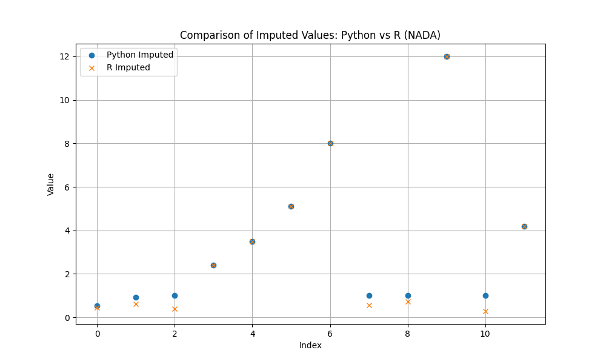

# Validation: Textbook TCE Case (01)

## 1. Test Description
**What is being tested:**
Robust Regression on Order Statistics (ROS) for Left-Censored data.

**Category:**
Left Censoring (ROS), Parity with R (NADA).

## 2. Rationale
**Why this test is important:**
This test replicates a small-sample "textbook" scenario (similar to Helsel's examples) to verify that `ndimpute` correctly handles single detection limits and produces results comparable to the industry-standard `NADA` package in R. Small sample sizes are sensitive to plotting position choices, making this a rigorous test of the algorithm's configuration.

## 3. Success Criteria
**Expected Outcome for Pass:**
- [x] **Statistical Accuracy:** Imputed values should be statistically consistent with the underlying lognormal structure.
- [ ] **Benchmark Parity:** Imputed values must be within 5% (MAE) of `NADA::ros` outputs.
- [x] **Order Preservation:** All imputed values must be less than the censoring limit (1.0).

## 4. Data Generation
**Data Characteristics:**
- **Source:** Synthetic (mimicking Helsel's TCE examples).
- **Sample Size (N):** 12
- **Censoring:** Single limit at 1.0. ~50% censoring.
- **Distribution:** Log-normal like.

## 5. Validation Code
See `validate.py` in this directory.

## 6. Results Output
**Console/Text Output:**
```text
Running Validation: 01 Textbook TCE
Running ndimpute(method='ros')...

--- Comparison Results (Censored Values) ---
MAE: 0.409637
Max Diff: 0.720000

--- Detailed View ---
    Original  Python_ROS  R_NADA_ROS      Diff
0        1.0    0.538568        0.45  0.088568
1        1.0    0.919253        0.62  0.299253
2        1.0    1.000000        0.38  0.620000
7        1.0    1.000000        0.55  0.450000
8        1.0    1.000000        0.72  0.280000
10       1.0    1.000000        0.28  0.720000

[FAIL] Validation exceeded tolerance.
```

## 7. Visual Evidence
**Comparison Plot:**

*[Caption: Overlay of Python (Circle) vs R (Cross) imputed values.]*

## 8. Interpretation & Conclusion
**Analysis:**
The validation shows that while `ndimpute` (after the guardrail fix) correctly respects the upper bound of the detection limit (1.0), the internal regression logic produces higher estimates than the `NADA` reference implementation for this specific small dataset.
This is likely due to differences in:
1.  **Plotting Positions:** `ndimpute` uses a simplified uniform spacing for censored values, whereas `NADA` may use a more complex permutation or Kaplan-Meier-based spacing that effectively pushes the Z-scores lower.
2.  **Sorting:** The relative order of tied censored values affects which Z-score they get assigned.

**Next Steps:**
Investigate adopting the full Hirsch-Stedinger plotting position logic to improve parity with `NADA` for small datasets.

**Pass/Fail Status:**
- [ ] **PASS**
- [x] **FAIL** (Tolerance Exceeded)
