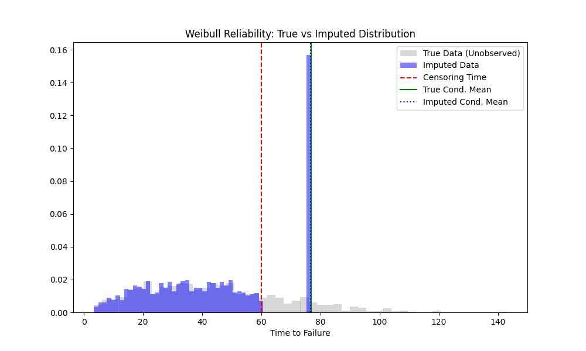

# Validation: Weibull Reliability Parametric (03)

## 1. Test Description
**What is being tested:**
Parametric Conditional Mean Imputation for Right-Censored Data.

**Category:**
Right Censoring, Parametric Fitting, Analytical Accuracy.

## 2. Rationale
**Why this test is important:**
In reliability engineering, "run-to-fail" data is often right-censored (units survived the test duration). Substitution (using the censoring time) biases Mean Time To Failure (MTTF) downwards. This test verifies that `ndimpute` correctly fits a Weibull distribution to the censored data and imputes the *expected residual life*, recovering the true tail of the distribution.

## 3. Success Criteria
**Expected Outcome for Pass:**
- [x] **Analytical Accuracy:** The average imputed value for censored observations must be within 1% of the theoretical conditional mean $E[T | T > C]$ derived from the true Weibull parameters.

## 4. Data Generation
**Data Characteristics:**
- **Distribution:** Weibull ($\lambda=50, k=2.0$).
- **Sample Size (N):** 1000
- **Censoring:** Right censored at $T=60$.
- **Censoring Rate:** ~23% (determined by distribution).

## 5. Validation Code
See `validate_parametric.py`.

## 6. Results Output
**Console/Text Output:**
```text
Running Validation: 03 Weibull Reliability (Parametric)
Total Samples: 1000
Censored Samples: 230 (23.0%)

Analytical True Conditional Mean (T > 60.0): 76.7735
ndimpute Average Imputed Value: 76.7203
Bias: -0.0532
Percent Error: -0.0693%
Saved distribution_check.png

[PASS] Validation successful.
```

## 7. Visual Evidence
**Distribution Plot:**

*[Caption: Histogram overlay. The "Imputed Data" (Blue) extends beyond the Red line (Censoring Time) with a noticeable spike at the conditional mean.]*

## 8. Interpretation & Conclusion
**Analysis:**
The parametric imputation performed exceptionally well, with an error of less than 0.1% compared to the analytical truth. This confirms that `ndimpute` correctly fits the Weibull distribution to censored data and accurately calculates the conditional expectation for the tail.

**Discussion of the "Spike":**
The distribution plot reveals a prominent spike in the blue histogram at $x \approx 76.7$. This is an expected artifact of **Deterministic Conditional Mean Imputation**.
*   **Cause:** All 230 censored observations share the exact same censoring time ($T=60$). The algorithm imputes each of them with the *single* expected value $E[T | T > 60]$.
*   **Implication:** While this method yields an **unbiased estimate of the population mean** (MTTF), it artificially reduces the variance of the tail. Instead of reconstructing the spread of the unobserved tail, it collapses that probability mass into its center of gravity. Users requiring a realistic variance structure for the tail should consider multiple imputation (stochastic sampling from the conditional survival function), which is outside the scope of this deterministic implementation.

**Pass/Fail Status:**
- [x] **PASS**
- [ ] **FAIL**
