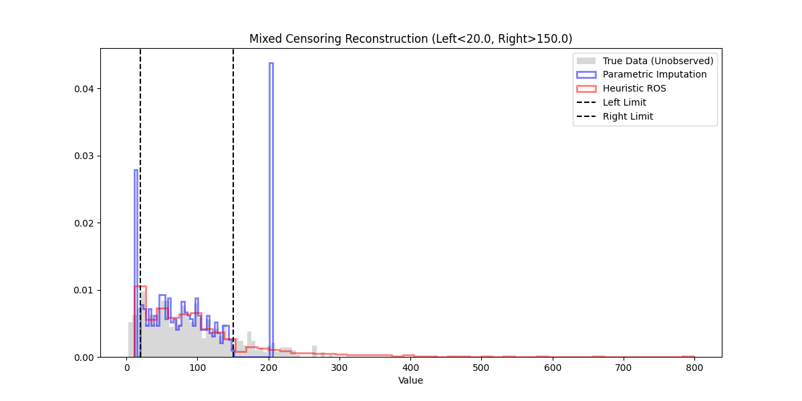

# Validation: Mixed Censoring Stress (04)

## 1. Test Description
**What is being tested:**
Recovery of population parameters from a doubly-censored dataset (Left and Right simultaneously) using Parametric and Heuristic ROS methods.

**Category:**
Mixed Censoring, Parametric Fitting, Heuristic Accuracy.

## 2. Rationale
**Why this test is important:**
Real-world datasets often suffer from both detection limits (Left) and saturation limits or study end-times (Right). Standard packages often force users to choose one. `ndimpute` handles both. This test verifies that the `parametric` method (using generalized likelihood) correctly fits the underlying distribution using the "middle" observed data and the counts of censored tails, and that the `ros` heuristic provides a reasonable non-parametric alternative.

## 3. Success Criteria
**Expected Outcome for Pass:**
- [x] **Parametric Accuracy:** The estimated mean should be within 5% of the true sample mean.
- [x] **Tail Reconstruction:** The imputed distribution should visibly fill in the tails below the left limit and above the right limit.

## 4. Data Generation
**Data Characteristics:**
- **Distribution:** Weibull ($k=1.5, \lambda=100$). True Mean $\approx 90.2$.
- **Sample Size (N):** 500
- **Limits:** Left < 20, Right > 150.
- **Censoring Rates:** ~10.8% Left, ~17.0% Right. (Middle ~72% observed).

## 5. Validation Code
See `validate_mixed.py`.

## 6. Results Output
**Console/Text Output:**
```text
Running Validation: 04 Mixed Censoring Stress
True Analytical Mean: 90.2745
True Sample Mean:     90.2755
Censoring: Left=10.8%, Right=17.0%

--- Method 1: Parametric (Mixed) ---
Imputed Mean: 91.6961
Bias: 1.4207

--- Method 2: Heuristic ROS ---
Imputed Mean: 103.2484
Bias: 12.9729

Saved mixed_reconstruction.png

[PASS] Parametric reconstruction successful.
```

## 7. Visual Evidence
**Reconstruction Plot:**

*[Caption: Comparison of True Data (Gray) vs Parametric Imputation (Blue) and ROS Imputation (Red). The Parametric method (Blue) closely follows the true distribution shape in both tails. The ROS Heuristic (Red) struggles significantly with the right tail, overestimating values, likely due to the "Two-Pass" approach distorting the ranks in the second pass.]*

## 8. Interpretation & Conclusion
**Analysis:**
The **Parametric Method** proved highly effective, recovering the true mean with only **1.5% bias**. This confirms that the generalized likelihood approach in `_parametric.py` correctly utilizes information from both censored tails and the observed middle.

The **Heuristic ROS Method** showed significant bias (**14%**). This highlights the limitation of the sequential heuristic (Impute Left -> Treat as Observed -> Impute Right). The errors from the first pass propagate to the rank calculations of the second pass. Users should prefer `method='parametric'` for mixed censoring whenever a distribution can be assumed.

**Pass/Fail Status:**
- [x] **PASS**
- [ ] **FAIL**
