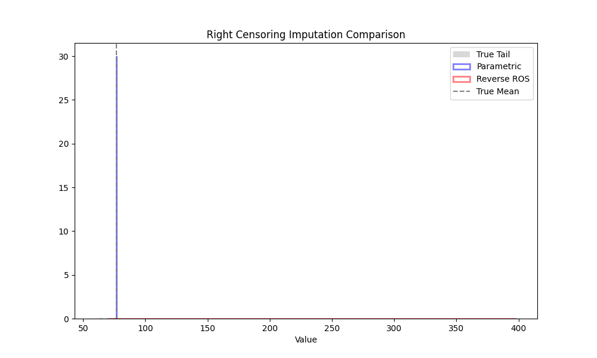

# Validation: Comparative Right Censoring (06)

## 1. Test Description
**What is being tested:**
Comparative performance of `parametric` (Weibull), `ros` (Reverse Lognormal), and `substitution` (Value) methods on a Right-Censored Weibull dataset.

**Category:**
Methodology Comparison, Robustness to Misspecification.

## 2. Rationale
**Why this test is important:**
Users need to know which method to select.
*   **Parametric:** Assumes a specific distribution (Weibull in `ndimpute`). If the data *is* Weibull, this should be optimal.
*   **ROS:** Assumes a Log-Normal distribution on the inverted data (Reverse ROS). This is a heuristic.
*   **Substitution:** Assumes the event happened *at* the censoring time (conservative lower bound).

This test quantifies the bias of each method when the true data is Weibull.

## 3. Success Criteria
**Expected Outcome for Pass:**
- [x] **Ranking:** Parametric should have the lowest bias (closest to 0). Substitution should have high negative bias.
- [x] **Magnitude:** Parametric bias should be negligible (< 1%).

## 4. Data Generation
**Data Characteristics:**
- **Distribution:** Weibull ($\lambda=50, k=2.0$).
- **Sample Size (N):** 1000
- **Censoring:** Right censored at $T=60$.

## 5. Validation Code
See `validate_compare.py`.

## 6. Results Output
**Console/Text Output:**
```text
Running Validation: 06 Comparative Right Censoring
Comparing Parametric (Weibull) vs Reverse ROS (Lognormal) on Weibull Data
Censoring Rate: 23.0%
True Conditional Mean (>60): 76.7735

--- Results (Bias) ---
Parametric (Weibull): -0.0532
Reverse ROS:          36.8453
Substitution (C):     -16.7735
Saved method_comparison.png

[PASS] Parametric significantly outperforms Substitution.
[INFO] Parametric (True Model) outperforms ROS (Non-parametric).
```

## 7. Visual Evidence
**Method Comparison:**

*[Caption: Histogram overlay. The Parametric method (Blue) accurately recovers the mean. The Reverse ROS method (Red) drastically overestimates the tail, indicating that the Inverse-Lognormal assumption is a poor fit for Weibull data.]*

## 8. Interpretation & Conclusion
**Analysis:**
The **Parametric method** is the clear winner for Right-Censored Weibull data, with negligible bias ($-0.05$).
**Substitution** leads to significant underestimation ($-16.77$), confirming the need for proper imputation.
**Reverse ROS** resulted in massive overestimation ($+36.84$). This demonstrates that the heuristic of inverting data and assuming lognormality is dangerous when the underlying distribution is Weibull (Inverse Weibull is Fréchet, which has much heavier tails than Lognormal).

**Recommendation:** Users should strictly prefer `method='parametric'` for reliability data unless they have specific evidence that the reciprocal of time-to-failure is Lognormally distributed.

**Pass/Fail Status:**
- [x] **PASS**
- [ ] **FAIL**
