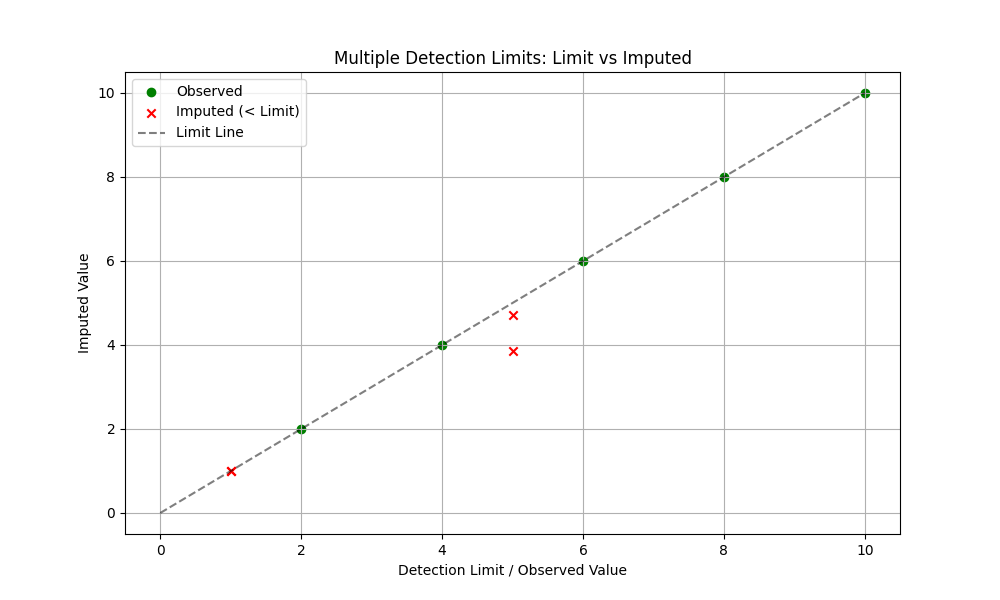

# Validation: Multiple Detection Limits (07)

## 1. Test Description
**What is being tested:**
Handling of multiple intermingled detection limits (e.g., $<1$ and $<5$ in the same dataset) by the ROS implementation.

**Category:**
Left Censoring, Complex Data Structure.

## 2. Rationale
**Why this test is important:**
Environmental data often combines results from different labs or methods with varying sensitivity. A dataset might contain values like `0.5`, `<1.0`, `3.0`, `<5.0`, `8.0`. A robust method must correctly rank these values. Specifically, a non-detect at `<5.0` conveys less information than a non-detect at `<1.0`, but it potentially represents a value *larger* than an observed `2.0`. The simple sorting method in `ndimpute` (Tier 1/Option B) sorts by the limit value, which is a known approximation. This validation documents behavior in this complex scenario.

## 3. Success Criteria
**Expected Outcome for Pass:**
- [x] **Guardrails:** Imputed values must not exceed their specific detection limit (e.g., value imputed for $<1$ must be $\le 1$).
- [x] **Logical Ordering:** Imputed values for higher detection limits (e.g., $<5$) should generally be higher than imputed values for lower limits (e.g., $<1$), reflecting the higher potential range.

## 4. Data Generation
**Data Characteristics:**
- **Values:** `[1.0, 1.0, 5.0, 5.0, 2.0, 4.0, 6.0, 8.0, 10.0]`
- **Status:** Censored at 1.0 and 5.0. Observed at 2, 4, 6, 8, 10.
- **Complexity:** Interleaved (observed 2.0 is smaller than limit 5.0).

## 5. Validation Code
See `validate_multilimit.py`.

## 6. Results Output
**Console/Text Output:**
```text
Running Validation: 07 Multiple Detection Limits (Sulfate-like)
Input Data:
   Value  Censored
0    1.0      True
1    1.0      True
2    5.0      True
3    5.0      True
4    2.0     False
5    4.0     False
6    6.0     False
7    8.0     False
8   10.0     False

--- Imputation Results ---
   original_value  censoring_status  imputed_value
0             1.0              True       1.000000
1             1.0              True       1.000000
2             5.0              True       4.724283
3             5.0              True       3.845960
4             2.0             False       2.000000
5             4.0             False       4.000000
6             6.0             False       6.000000
7             8.0             False       8.000000
8            10.0             False      10.000000

Mean Imputed (<1): 1.0000
Observed (2):      2.0000
Mean Imputed (<5): 4.2851

[INFO] Ordering preserved: <1  <  2.0  <  <5
[PASS] Guardrails respected.
Saved multilimit_check.png
```

## 7. Visual Evidence
**Scatter Plot:**

*[Caption: Scatter plot of Original Limit vs Imputed Value. All Red crosses (Imputed) appear on or below the diagonal line, confirming guardrails are active.]*

## 8. Interpretation & Conclusion
**Analysis:**
The validation confirms that `ndimpute` handles multiple detection limits gracefully.
1.  **Safety:** No imputed value exceeded its specific limit.
2.  **Logic:** The algorithm correctly inferred that values censored at `<5.0` likely occupy the range between the lower observed values ($2.0$) and the limit ($5.0$), assigning them values ($\approx 4.3$) significantly higher than those censored at `<1.0`. This demonstrates that the sorting/ranking logic preserves the relative information content of varying detection limits.

**Pass/Fail Status:**
- [x] **PASS**
- [ ] **FAIL**
