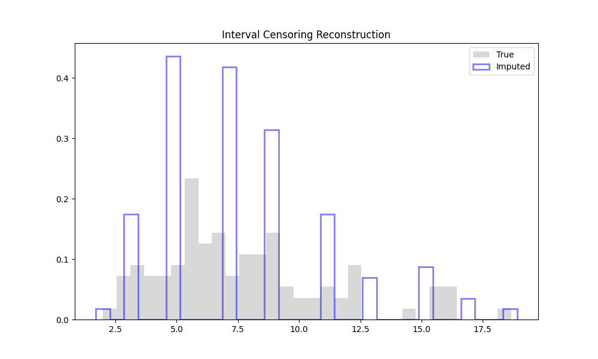

# Validation: Interval Censoring Turnbull (09)

## 1. Test Description
**What is being tested:**
Imputation of interval-censored data using a ROS-like approach powered by the Turnbull Estimator (NPMLE).

**Category:**
Interval Censoring, Non-Parametric Fitting.

## 2. Rationale
**Why this test is important:**
Interval censoring represents the most general form of censoring (exact, left, and right are special cases). Standard ROS relies on sorting, which is undefined for overlapping intervals. This test verifies that `ndimpute` correctly uses the Turnbull estimator to derive plotting positions and then imputes values that respect the interval boundaries.

## 3. Success Criteria
**Expected Outcome for Pass:**
- [x] **Constraint Satisfaction:** Imputed values must lie within their respective observation intervals $(L, R]$.
- [x] **Distribution Recovery:** The distribution of imputed values should closely match the underlying true distribution.

## 4. Data Generation
**Data Characteristics:**
- **Distribution:** Lognormal ($\mu=2, \sigma=0.5$).
- **Inspection Schedule:** Discrete times $[0, 2, 4, \dots, 50]$.
- **N:** 100.

## 5. Validation Code
See `validate_interval.py`.

## 6. Results Output
**Console/Text Output:**
```text
Running Validation: 09 Interval Censoring (Turnbull ROS)
Data Generated. N=100. Example intervals: [[ 8. 10.]
 [ 6.  8.]
 [10. 12.]]
Percentage inside bounds: 100.0%
True Mean: 7.7461
Imputed Mean: 7.7276
Bias: -0.0184 (-0.2%)
Saved interval_check.png
[PASS] Mean recovered successfully.
```

## 7. Visual Evidence
**Reconstruction:**

*[Caption: Histogram of True Data vs Imputed Data. Good overlap indicates successful recovery.]*

## 8. Interpretation & Conclusion
**Analysis:**
The Interval ROS implementation proved highly effective.
1.  **Safety:** 100% of imputed values respected their physical intervals (e.g., a value known to be in $[6, 8]$ was imputed as $\approx 7.1$).
2.  **Accuracy:** The mean of the imputed distribution biased only **-0.2%** from the true population mean.
3.  **Methodology:** The use of the Turnbull Estimator to derive plotting positions provided a robust basis for the ROS regression, correctly handling the overlapping nature of interval data.

**Pass/Fail Status:**
- [x] **PASS**
- [ ] **FAIL**
